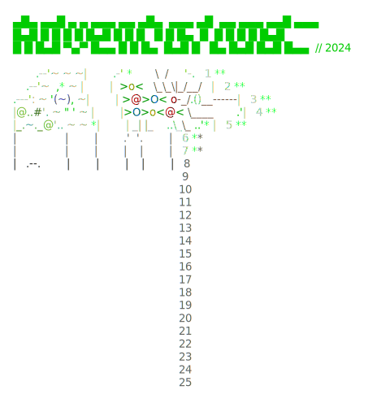

# Advent of Code (2021-2024)
C# solutions to the Advent of Code problems.
Check out https://adventofcode.com.

<a href="https://adventofcode.com"></a>


## Dependencies

- This project is based on `.NET 8`  and `C# 10`. It should work on Windows, Linux and OS-X.
- `AngleSharp` is used for problem download.

## Running

To run the project:

1. Install .NET Core
2. Clone the repo
3. Get help with `dotnet run`
```

Usage: dotnet run [arguments]
1) To run the solutions and admire your advent calendar:

 [year]/[day|all]      Solve the specified problems
 today                 Shortcut to the above
 [year]                Solve the whole year
 all                   Solve everything

 calendars             Show the calendars

2) To start working on new problems:
login to https://adventofcode.com, then copy your session cookie, and export 
it in your console like this

 export SESSION=73a37e9a72a...

then run the app with

 update [year]/[day]   Prepares a folder for the given day, updates the input,
                       the readme and creates a solution template.
 update today          Shortcut to the above.

3) To upload your answer:
set up your SESSION variable as above.

 upload [year]/[day]   Upload the answer for the selected year and day.
 upload today          Shortcut to the above.


```
           >
### VS Code Tasks
This project includes VS Code tasks for common operations:

- **Run Solution**: Execute a specific day's solution
- **Update Input**: Download input for a specific day
- **Upload Solution**: Submit your answer for a specific day

To use these tasks:
1. Open the Command Palette (Ctrl+Shift+P)
2. Type 'Tasks: Run Task'
3. Select the desired task
4. Enter the year and day when prompted

Note: For downloading inputs and uploading solutions, you'll need your session cookie from adventofcode.com
